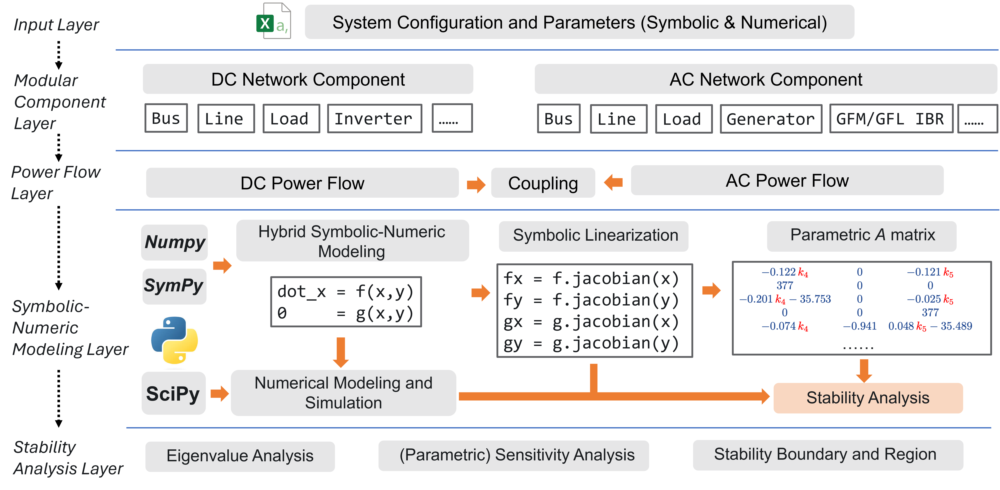

# **SyNAPS**

---

# **Sy**mbolic–**N**umerical Modeling and Stability **A**nalysis Platform for DC/AC **P**ower **S**ystems

As modern power systems become increasingly complex—integrating diverse inverter-based resources and advanced control schemes—there is a growing need for analysis tools that combine analytical rigor with computational flexibility. Traditional purely numerical simulations often lack transparency. SyNAPS bridges this gap by unifying symbolic computation with numerical simulation, enabling scalable modeling, analysis, and control design for DC and AC power systems.

It has the following key capabilities:

- ## Hybrid Symbolic–Numerical Modeling

Integrates SymPy and SciPy to connect symbolic derivations with numerical evaluation. Symbolic models capture system structure and parameter dependencies, while numerical routines reduce the modeling complexity and enable scalable evaluation and simulation.

- ## Symbolic Linearization

Automatically derives Jacobian matrices and linearized state-space models from nonlinear differential algebraic equations (DAEs). This enables transparent analysis of how operating points, grid conditions, and control strategies influence small-signal dynamics.

- ## Numerical Simulation

Leverages SciPy for numerical linear algebra, eigenvalue analysis, and time-domain simulation.

- ## Parametric Stability Characterization

Defines parameter spaces (e.g., droop gains, PLL gains) and certifies stability using algebraic methods such as Linear Matrix Inequalities (LMIs) and convex optimization. Facilitates control co-design and exploration of stability boundaries.

# SyNAPS Framework

# Quick Tutorial

**SyNAPS** is developed using both **Python** and **MATLAB**. The **symbolic–numerical modeling** and **eigenvalue/sensitivity analysis** modules are implemented in Python, leveraging libraries such as **Sympy**, **Scipy**, and **Numpy**. The **LMI-based stability boundary and region identification** module is developed in MATLAB.

To get started:

1. **Fork** the repository and navigate to the **`example`** folder.
2. Open the main **Jupyter Notebook**, which generates the **parametric A-matrix** and exports it as a MATLAB `.m` file.
3. After exporting, go to the **`stability`** folder to perform **stability boundary and region identification**.

# Team

- **Buxin She (PI)** – Conceptualization and framework design; DC network module development
- **Ramij R. Hossain (Co-PI)** – Symbolic–numerical modeling module development; AC network and DC-AC coupling module development
- **Soumya Kundu (Co-PI)** – Small-signal stability boundary and region identification module development
- **Marcelo Elizondo (Thrust Lead)** – Advisor
- **Veronica Adetola (Initiative Lead)** – Advisor

# Acknowledgement

This work is funded by the Laboratory Directed Research and Development (LDRD) at the Pacific Northwest National Laboratory (PNNL) as part of the E-COMP initiative. PNNL is operated by Battelle for the DOE under Contract DOE-AC05-76RL01830

# Cite Our Work

To be released.

# License

Released under the GPL3 license.
